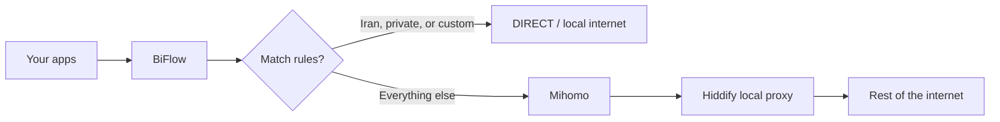
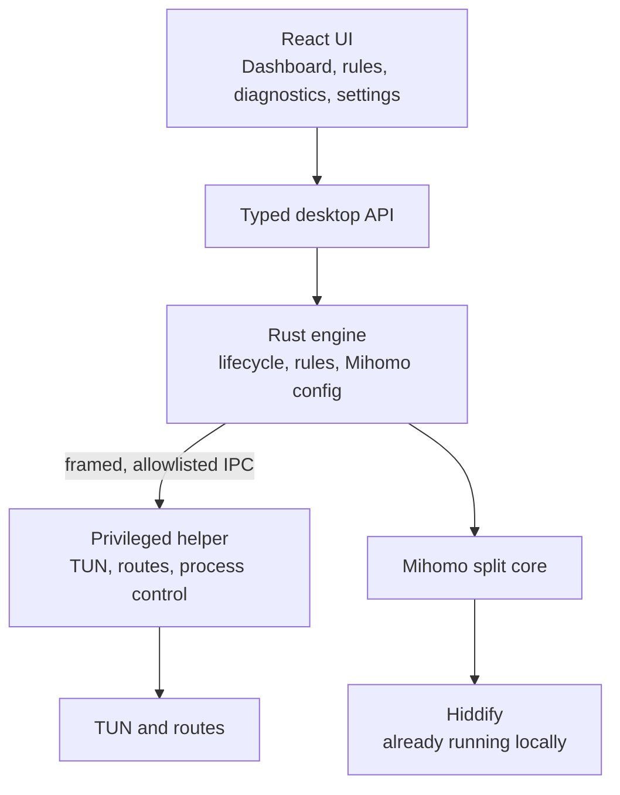

<p align="center">
  
</p>

<h1 align="center">BiFlow</h1>

<p align="center"><strong>Right traffic. Right route.</strong></p>

<p align="center">
  Iranian and private traffic stays on the local internet.<br />
  Everything else follows the Hiddify connection you already use.
</p>

<p align="center">
  <a href="#how-it-works">How it works</a>
  ·
  <a href="#architecture">Architecture</a>
  ·
  <a href="#develop">Develop</a>
  ·
  <a href="#faq">FAQ</a>
</p>

---

## Description

BiFlow is a desktop app for split routing. It keeps Iranian websites, Iranian IP
ranges, and private/local networks **DIRECT**. Other destinations go through
your existing **Hiddify** local proxy, using **Mihomo** as the split engine.

The window always runs as your normal user. Privileged work (TUN device, routes)
stays in a small helper process with a strict command list. BiFlow does not
replace Hiddify. It sits beside it and chooses the path for each destination.

English and Persian are built in. The dashboard reports exact helper, Hiddify,
Mihomo, TUN, and DNS state; its status bar shows internet reachability, public
IP, and approximate country. Mihomo and the full Iran rule snapshot ship inside
the OS package, so their first use does not need a download. Hiddify remains an
allowlisted official download when it is missing.

## How it works

1. Install BiFlow (Linux `.deb`, or Windows app / NSIS setup).
2. Keep Hiddify installed and able to listen locally. BiFlow installs its
   bundled Mihomo build when needed.
3. Open **Direct rules** if you want extra sites or IPs to stay DIRECT, or to
   refresh Iran domain and IP lists from the cloud.
4. Press **Connect**. BiFlow prepares a routing generation, starts Mihomo, and
   asks the helper to attach the TUN and routes.
5. Iranian, private, and your custom rules stay DIRECT. Other traffic uses
   Hiddify. The dashboard animates both routes while connected, and
   **Diagnostics** can test a host and show DIRECT vs VPN before you rely on it.
   Its support export includes the permanent, locally redacted `debug.log`,
   which records Rust actions, warnings, errors, causes, initiators, and trace
   IDs for troubleshooting. Diagnostics shows its size and lets you reveal or
   delete it when you choose.
6. **Disconnect** tears the owned TUN and routes down. A failed start rolls back
   instead of leaving a half-applied network.

Cloud rule updates try GitHub first, then jsDelivr mirrors. A failed refresh
keeps the last good cache, or the snapshot bundled with the app.



## Architecture

BiFlow is a Tauri 2 desktop app: a React UI in a webview, a Rust engine in the
same process, and a privileged helper in a separate process.



| Piece       | Role                                                                                                                            |
| ----------- | ------------------------------------------------------------------------------------------------------------------------------- |
| **UI**      | Connect/disconnect, install missing apps, cloud and custom DIRECT rules, flow tests. No shell and no general filesystem access. |
| **Engine**  | Owns configuration, rule decisions, Mihomo YAML, and rollback. Talks to the UI only through the typed API.                      |
| **Helper**  | Applies TUN and routes. Accepts generation IDs and hashes, never executable paths, shell strings, or arbitrary URLs.            |
| **Mihomo**  | Enforces split routing. Controller binds to loopback with a generated secret.                                                   |
| **Hiddify** | Upstream proxy you already use. BiFlow does not log into it or replace it.                                                      |
| **Rules**   | Bundled Iran lists, optional cloud refresh, plus your extra DIRECT domains and IPs.                                             |

Internal Rust crates still use the `iran-split-*` names. The product name, window
title, and install identifiers are **BiFlow**.

## Develop

Prerequisites: Node.js 22+, pnpm 9.0.1, Rust 1.88. Linux desktop builds also
need WebKitGTK 4.1 and GTK 3 development packages.

```bash
./dev.sh          # native Tauri app (UI talks to Rust)
./dev.sh web      # browser UI with a safe mock backend
./dev.sh check    # format, lint, typecheck, tests
./dev.sh e2e      # Playwright primary flows against the mock UI
```

`./dev.sh` and `./dev.sh desktop` compile the real app and, on Linux, ask for
`sudo` to run a hardened transient helper for your developer UID. The helper
socket and runtime stay under `/run/biflow-dev-<uid>`; verified helper and
Mihomo binaries live under `/var/lib/biflow-dev-<uid>` because `/run` is
typically mounted `noexec`. Everything is stopped and removed when `dev.sh`
exits. Run the script as your normal account, not as root. `./dev.sh web` never
touches TUN, routes, DNS, or system services.

Release packages:

```bash
./build.sh            # Linux .deb and Windows .exe + NSIS installer
./build.sh linux      # artifacts/linux/BiFlow_<version>_amd64.deb
./build.sh windows    # artifacts/windows/BiFlow.exe and NSIS setup
```

`./build.sh` installs missing Node.js, pnpm, Rust, Linux desktop libraries,
NSIS, and cargo-xwin, then writes files under `artifacts/`. Version comes from
the root `version` file. Change that file only, then run `pnpm version:sync`.

```bash
pnpm test                 # UI unit tests
cargo test -p <crate>     # tests for a crate you changed
pnpm test:e2e             # Playwright
pnpm check                # format, lint, typecheck, unit tests, version sync
cargo run -p iran-split-cli -- demo
```

Deeper notes: [helper IPC](docs/protocol/helper-ipc-v1.md),
[architecture decisions](docs/adr/README.md),
[implementation roadmap](iran-split-desktop-implementation-roadmap-fa.md).

## FAQ

**Does BiFlow replace my VPN?**
No. It uses the Hiddify connection you already have. Iranian and private
destinations skip that tunnel; other destinations still use it.

**Do I have to install Hiddify and Mihomo myself?**
Mihomo is included in each OS package and installs locally. Hiddify is detected
from common locations; if it is missing, BiFlow offers the official release and
keeps a manual guide as fallback.

**Will sites like Digikala go through the VPN?**
No, if they match the Iran domain or IP lists, or a custom DIRECT rule you
added. Use **Diagnostics → Test flow** to confirm a host.

**What if cloud rule update fails?**
Routing keeps working. BiFlow keeps the last successful cache, or the lists
shipped with the app.

**Is the app window a root process?**
No. The UI runs as your user. Only the helper performs privileged network
changes, over a versioned, size-limited, allowlisted local protocol.

**Which platforms are supported?**
Linux (Debian package and AppImage) and Windows (portable `.exe` and NSIS
installer). Windows packages can be built on Windows, or cross-compiled from
Linux. Pushing a `v*` tag publishes those four artifacts as GitHub Release
assets.

**Can I add my own DIRECT sites?**
Yes. **Direct rules** stores extra domains and IPs. They take precedence over
the Iran lists.

**Where does the version number come from?**
The `version` file in the repository root. Installers, the UI, and Cargo
manifests follow that file after `pnpm version:sync`.
