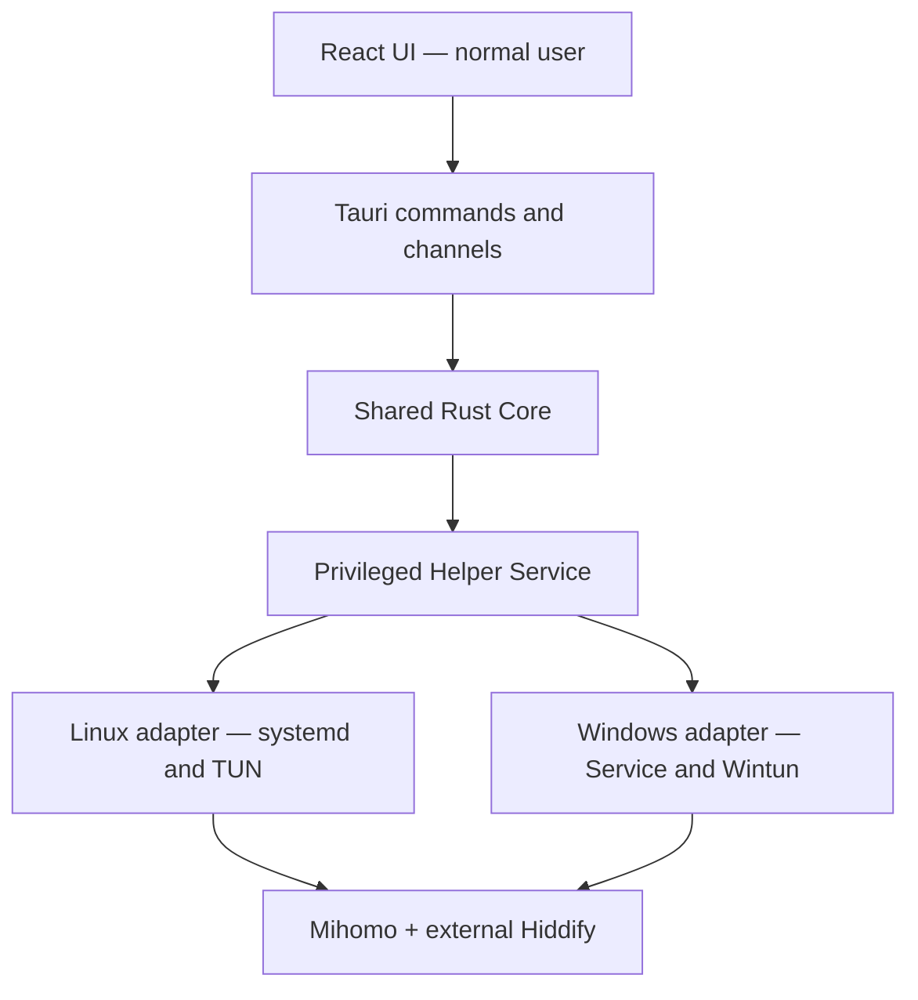

# نقشه‌راه اجرایی Iran Split Desktop

## Tauri 2 + React/TypeScript + Rust

**وضعیت سند:** مبنای پیاده‌سازی نسخهٔ اول  
**هدف پلتفرم نسخهٔ اول:** Windows 10/11 x86_64 و Linux x86_64  
**برآورد برای یک توسعه‌دهندهٔ باتجربه و تمام‌وقت:** Linux MVP حدود ۵ تا ۷ هفته؛ نسخهٔ Production برای Windows و Linux حدود ۱۲ تا ۱۶ هفته  
**اصل معماری:** رابط گرافیکی با دسترسی عادی اجرا می‌شود و عملیات TUN/Route فقط در یک Helper Service محدود و جداگانه انجام می‌شود.

---

## 1. نتیجهٔ نهایی مورد انتظار

در پایان نسخهٔ اول، کاربر باید بتواند بدون استفاده از command line:

1. Hiddify، Mihomo و TUN را با یک دکمه راه‌اندازی یا متوقف کند.
2. وضعیت هر مؤلفه، backend فعال، IP خروجی، قوانین و خطاها را ببیند.
3. دامنه‌های `DIRECT` سفارشی را اضافه، حذف و refresh کند.
4. یک دامنه یا IP را تست کند و ببیند از `DIRECT` یا `VPN` عبور کرده است.
5. تنظیمات، رفتار startup، مسیر Hiddify و سطح log را تغییر دهد.
6. برنامه را در System Tray اجرا کند و در صورت بسته‌شدن پنجره، اتصال را حفظ کند.
7. گزارش عیب‌یابیِ پاک‌سازی‌شده از اطلاعات حساس تولید کند.
8. نسخهٔ امضاشدهٔ Windows و بسته‌های قابل نصب Linux را دریافت و به‌روزرسانی کند.

معیار اصلی موفقیت فقط «بالا آمدن UI» نیست؛ بعد از Stop، Crash یا Uninstall نباید TUN، route یا DNS نیمه‌فعال روی سیستم باقی بماند.

---

## 2. محدودهٔ نسخهٔ اول

### 2.1 موارد داخل Scope

- برنامهٔ دسکتاپ Tauri 2 با React و TypeScript
- Rust Core مشترک برای lifecycle، config، rules، diagnostics و state machine
- Helper Service دارای دسترسی بالا برای Linux و Windows
- مدیریت lifecycle مربوط به Mihomo
- تشخیص و در صورت نیاز اجرای Hiddify موجود روی سیستم
- استفاده از SOCKS/Mixed endpoint فعلی Hiddify، با پیش‌فرض `127.0.0.1:12334`
- Split routing ایران بر اساس domain و CIDR
- custom exact-domain exceptions و IP cache متناظر
- dashboard، settings، rules، diagnostics، logs و system tray
- installer، uninstall، rollback، code signing و update workflow
- UI انگلیسی و زیرساخت i18n؛ فارسی می‌تواند در همان نسخه یا بلافاصله پس از MVP فعال شود
- حفظ نسخهٔ CLI فعلی تا زمان جایگزینی کامل

### 2.2 موارد خارج از Scope نسخهٔ اول

- مدیریت subscription و profileهای Hiddify
- جایگزین‌کردن Hiddify Core یا پیاده‌سازی protocolهای proxy
- Android، iOS و macOS
- معماری multi-user کامل روی یک دستگاه
- remote management یا پنل ابری
- account، login، telemetry اجباری یا analytics
- per-application routing عمومی به‌جز bypassهای ضروری Hiddify/Tailscale
- ویرایشگر آزاد YAML برای کاربر عادی

افزودن هرکدام از موارد بالا باید به‌عنوان milestone جدا ارزیابی شود؛ قرار دادن آن‌ها در نسخهٔ اول ریسک Windows و TUN را پنهان می‌کند.

---

## 3. فرض‌های اجرایی

- Hiddify از قبل نصب شده و حداقل یک profile سالم دارد.
- برنامه Hiddify را از طریق local proxy آن مصرف می‌کند و به دیتابیس داخلی Hiddify وابسته نمی‌شود.
- Mihomo به‌صورت binary نسخه‌بندی‌شده و checksum-verified همراه محصول توزیع می‌شود.
- در نسخهٔ اول فقط یک کاربر مجاز در هر نصب ثبت می‌شود.
- پورت‌ها در حالت عادی فقط روی loopback باز می‌شوند.
- اعلام وضعیت `Running` نیازمند egress واقعی Hiddify است، ولی آماده‌سازی config و ruleها باید با snapshot داخلی و بدون دسترسی اولیه به GitHub ممکن باشد.
- همهٔ عملیات lifecycle باید idempotent باشند؛ اجرای دوبارهٔ Start یا Stop نباید state را خراب کند.

---

## 4. معماری هدف



### 4.1 مسئولیت مؤلفه‌ها

| مؤلفه | مسئولیت | نباید انجام دهد |
|---|---|---|
| React UI | نمایش state، دریافت input، UX، tray window | اجرای shell، دسترسی مستقیم به فایل‌های سیستمی یا elevation |
| Tauri Host | commandهای محدود، lifecycle پنجره، pluginها، انتقال event/channel | اجرای command دلخواه از frontend |
| Rust Core | state machine، config، validation، Mihomo API، rules، diagnostics | تغییر route بدون Helper |
| Helper Service | start/stop Mihomo، مالکیت TUN، cleanup، عملیات محدود privileged | UI، parsing input خام یا اجرای executable دلخواه |
| Linux adapter | systemd/service، Unix socket، process identity، route cleanup | فرض‌کردن وجود Windows API |
| Windows adapter | Windows Service، Named Pipe، ACL، firewall، TUN cleanup | اجرای Bash یا وابستگی به WSL |
| Mihomo | TUN، DNS، rules، controller API | مدیریت UI و تنظیمات سطح محصول |
| Hiddify | profile و upstream proxy | تصمیم‌گیری split routing این برنامه |

### 4.2 اصل جداسازی دسترسی

- `Iran Split Desktop` همیشه با user معمولی اجرا می‌شود.
- `iran-split-helper` تنها مؤلفهٔ privileged است.
- UI فقط commandهای مشخصی مثل `start_stack`، `stop_stack` و `add_direct_rule` می‌شناسد.
- APIای مانند `run_shell(command: String)` یا پذیرش path دلخواه در Helper ممنوع است.
- Helper فقط از installation directory و runtime directory کنترل‌شده binary اجرا می‌کند.

---

## 5. ساختار پیشنهادی Repository

```text
iran-split-desktop/
├── apps/
│   └── desktop/
│       ├── src/                    # React application
│       ├── public/
│       ├── package.json
│       └── vite.config.ts
├── crates/
│   ├── iran-split-core/            # domain logic and state machine
│   ├── iran-split-config/          # typed config + Mihomo generator
│   ├── iran-split-mihomo/          # controller client and process models
│   ├── iran-split-rules/           # provider and custom rule management
│   ├── iran-split-ipc/             # versioned helper protocol
│   ├── iran-split-helper/          # privileged service executable
│   ├── iran-split-platform-linux/  # Linux implementation
│   ├── iran-split-platform-win/    # Windows implementation
│   └── iran-split-cli/             # internal/compatibility CLI
├── src-tauri/
│   ├── capabilities/
│   ├── binaries/                   # target-specific bundled resources
│   ├── icons/
│   ├── src/
│   ├── Cargo.toml
│   └── tauri.conf.json
├── resources/
│   ├── rules/                      # immutable bootstrap snapshots
│   ├── templates/                  # Mihomo config templates if needed
│   └── licenses/
├── packaging/
│   ├── linux/                      # service, polkit/setup, deb scripts
│   └── windows/                    # NSIS hooks, service/firewall scripts
├── tests/
│   ├── fixtures/
│   ├── integration/
│   └── e2e/
├── docs/
│   ├── adr/
│   ├── protocol/
│   └── operations/
├── Cargo.toml                      # Cargo workspace
├── Cargo.lock
├── pnpm-workspace.yaml
├── pnpm-lock.yaml
├── rust-toolchain.toml
└── README.md
```

### ADRهای اولیه

- `ADR-001-tauri-react-rust.md`
- `ADR-002-privileged-helper-boundary.md`
- `ADR-003-versioned-local-ipc.md`
- `ADR-004-external-hiddify-lifecycle.md`
- `ADR-005-config-generation-and-storage.md`
- `ADR-006-native-build-per-platform.md`
- `ADR-007-installer-driven-helper-updates.md`

هر تصمیمی که security boundary، storage، protocol یا packaging را تغییر می‌دهد باید ADR داشته باشد.

---

## 6. انتخاب‌های فنی قطعی

### 6.1 Frontend

- React + TypeScript + Vite
- Tailwind CSS
- shadcn/ui یا Radix UI برای primitiveهای accessibility
- Zustand برای UI state محلی
- React Hook Form + Zod برای formها
- i18next برای ترجمه و RTL
- Vitest + React Testing Library
- WebdriverIO Tauri Service برای E2E

کامپوننت‌ها نباید مستقیماً `invoke()` را صدا بزنند. تمام IPC در `src/api/desktop.ts` و modelهای مشترک متمرکز می‌شود.

### 6.2 Rust

- `tokio` برای async runtime
- `serde` و `serde_json` برای IPC
- `toml` برای app config
- `reqwest` برای Mihomo controller و probes
- `thiserror` برای خطاهای domain
- `tracing` برای logging ساخت‌یافته
- `uuid` برای operation/request ID
- `sha2` برای integrity verification
- `sysinfo` همراه با APIهای native برای process inspection
- `clap` برای CLI داخلی
- `tempfile` و atomic rename برای publication امن

وابستگی‌ها باید با `Cargo.lock` و `pnpm-lock.yaml` pin شوند. نسخهٔ Rust نیز در `rust-toolchain.toml` ثابت می‌شود.

### 6.3 ارتباط UI و Rust

- Tauri Command برای request/responseهای محدود
- Tauri Event برای state changeهای کم‌حجم
- Tauri Channel برای log و progress stream
- یک snapshot کامل هنگام بازشدن پنجره؛ سپس delta/event

### 6.4 ارتباط Desktop Core و Helper

- Linux: Unix domain socket
- Windows: Named Pipe
- payload: JSON فریم‌شده و versioned
- هر request دارای `request_id`، `protocol_version` و command enum
- Helper قبل از اجرای command هویت peer را از OS بررسی می‌کند
- timeout، cancellation و maximum message size اجباری است

---

## 7. مدل State و Lifecycle

### 7.1 Stateهای اصلی

```rust
pub enum StackPhase {
    Uninitialized,
    Stopped,
    StartingHiddify,
    PreparingRuntime,
    ValidatingConfig,
    StartingCore,
    CheckingReadiness,
    Running,
    Degraded,
    Stopping,
    Recovering,
    Error,
}
```

### 7.2 Snapshot قابل نمایش

```rust
pub struct StackSnapshot {
    pub revision: u64,
    pub phase: StackPhase,
    pub operation_id: Option<Uuid>,
    pub hiddify: ComponentStatus,
    pub mihomo: ComponentStatus,
    pub tun: ComponentStatus,
    pub providers: ProviderSummary,
    pub exit_ip: Option<String>,
    pub backend: BackendKind,
    pub last_error: Option<AppError>,
    pub updated_at: DateTime<Utc>,
}
```

### 7.3 قواعد lifecycle

- در هر لحظه فقط یک operation تغییردهنده مجاز است.
- `Start` روی state فعال، status را refresh می‌کند و موفق برمی‌گردد.
- `Stop` روی state متوقف، موفق و بدون اثر جانبی است.
- شکست پس از شروع Helper باید rollback ایجاد کند.
- Hiddify در failed start به‌صورت پیش‌فرض باز می‌ماند تا قابل بررسی باشد.
- Stop فقط وقتی موفق است که TUN و routeهای مالکیت‌دار برنامه حذف شده باشند.
- هر route، firewall rule و process باید با installation ID برچسب یا قابل تشخیص باشد.
- startup پس از crash ابتدا orphan state را reconcile می‌کند.

---

## 8. قراردادهای API

### 8.1 Tauri Commands

```text
bootstrap_app() -> BootstrapResult
get_stack_snapshot() -> StackSnapshot
start_stack(options) -> OperationAccepted
stop_stack(options) -> OperationAccepted
restart_stack() -> OperationAccepted
cancel_operation(operation_id) -> Result

get_settings() -> AppConfigView
validate_settings(draft) -> ValidationResult
save_settings(draft, expected_revision) -> AppConfigView

list_direct_rules() -> DirectRulesView
add_direct_rule(input) -> RuleMutationResult
remove_direct_rule(domain) -> RuleMutationResult
refresh_direct_rules() -> OperationAccepted

run_full_diagnostics() -> OperationAccepted
test_route(target) -> RouteTestResult
query_logs(filter, cursor) -> LogPage
export_support_bundle(options) -> ExportResult

check_for_update() -> UpdateStatus
install_update() -> OperationAccepted
```

### 8.2 Helper Commands

Helper فقط commandهای زیر را می‌پذیرد:

```text
hello / protocol negotiation
get_service_status
register_runtime_generation
start_mihomo(generation_id, config_sha256)
stop_mihomo
restart_mihomo(generation_id, config_sha256)
get_mihomo_process_status
cleanup_owned_network_state
collect_service_logs
prepare_for_update
```

Helper نباید موارد زیر را بپذیرد:

- executable path از client
- shell string
- config path دلخواه
- URL دلخواه برای دانلود
- arbitrary file read/write
- service name یا PID تأییدنشده

Desktop Core ابتدا config را validate می‌کند، آن را در staging کنترل‌شده قرار می‌دهد و hash می‌فرستد. Helper دوباره schema، path، hash و ownership را بررسی و سپس generation را publish می‌کند.

### 8.3 مدل خطا

```rust
pub struct AppError {
    pub code: ErrorCode,
    pub message_key: String,
    pub retryable: bool,
    pub remediation: Option<Remediation>,
    pub technical_details: Option<String>,
    pub correlation_id: Uuid,
}
```

UI به `code` و `message_key` وابسته است، نه متن خام Rust یا log سیستم.

نمونه codeها:

- `HIDDIFY_NOT_FOUND`
- `HIDDIFY_PORT_BUSY`
- `HIDDIFY_EGRESS_UNAVAILABLE`
- `CONFIG_INVALID`
- `HELPER_UNAVAILABLE`
- `HELPER_UNAUTHORIZED`
- `MIHOMO_START_FAILED`
- `CONTROLLER_TIMEOUT`
- `PROVIDER_NOT_READY`
- `TUN_CLEANUP_FAILED`
- `ROUTE_TEST_FAILED`
- `UPDATE_SIGNATURE_INVALID`

---

## 9. Config و مسیرهای داده

### 9.1 یک Source of Truth

تنظیمات تکراری فعلی میان `stack.env` و `config.yaml` حذف می‌شوند. `AppConfig` منبع اصلی است و Rust از روی آن config نهایی Mihomo را تولید می‌کند.

```toml
schema_version = 1

[hiddify]
host = "127.0.0.1"
port = 12334
executable = "auto"
start_timeout_seconds = 45
stop_with_stack = true

[mihomo]
controller_host = "127.0.0.1"
controller_port = 19090
mixed_port = 17890
dns_port = 1053
tun_name = "clash-iran"
log_level = "info"

[rules]
refresh_interval_minutes = 15
upstream_refresh_hours = 24

[behavior]
launch_at_login = false
connect_at_launch = false
close_to_tray = true
```

### 9.2 مسیرها

| داده | Linux | Windows |
|---|---|---|
| User config | `$XDG_CONFIG_HOME/iran-split/config.toml` | `%APPDATA%\IranSplit\config.toml` |
| User data | `$XDG_DATA_HOME/iran-split/` | `%LOCALAPPDATA%\IranSplit\` |
| User cache | `$XDG_CACHE_HOME/iran-split/` | `%LOCALAPPDATA%\IranSplit\cache\` |
| System runtime | `/var/lib/iran-split/` | `%ProgramData%\IranSplit\` |
| Service binary | `/opt/iran-split/` یا distro path | `%ProgramFiles%\IranSplit\` |
| Service socket | `/run/iran-split/helper.sock` | `\\.\pipe\iran-split-helper-v1` |

### 9.3 الزامات storage

- atomic write با temporary file و rename
- config migration بر اساس `schema_version`
- backup قبل از migration
- permission محدود برای config و controller secret
- log rotation و سقف حجم
- secrets در log، diagnostics و support bundle redacted شوند
- rule snapshotهای داخل installer immutable هستند؛ cacheهای live در data directory قرار می‌گیرند

---

## 10. مدل امنیتی

### 10.1 Tauri

- فقط capabilityهای لازم برای پنجرهٔ `main` فعال شوند.
- `shell` plugin در frontend فعال نشود.
- filesystem access از UI حذف یا فقط به export dialog محدود شود.
- Content Security Policy مشخص تعریف شود.
- remote content داخل main webview بارگذاری نشود.
- single-instance plugin قبل از سایر pluginها ثبت شود.
- updater public key در binary و private key فقط در CI secret نگهداری شود.

### 10.2 Mihomo Controller

- فقط روی `127.0.0.1` bind شود.
- `secret` در هر نصب به‌صورت تصادفی تولید شود؛ مقدار خالی ممنوع است.
- CORS باز و `allow-origins: ['*']` استفاده نشود.
- desktop core تمام درخواست‌ها را با Bearer token ارسال کند.
- Named Pipe یا Unix API بدون secret فقط وقتی مجاز است که ACL/permission آن مستقل بررسی شده باشد؛ نسخهٔ اول از REST loopback دارای secret استفاده می‌کند.

### 10.3 Linux Helper

- system service با API محدود
- احراز peer با `SO_PEERCRED`
- allowlist کاربر نصب‌شده؛ ثبت اولیه فقط با elevation
- `NoNewPrivileges=yes` در بخش‌هایی که با نیاز capability تضاد ندارد
- `CapabilityBoundingSet=CAP_NET_ADMIN CAP_NET_RAW`
- working directory و executable path ثابت
- socket و runtime directory با mode محدود
- عدم اعتماد به environment، PATH و current working directory client

### 10.4 Windows Helper

- Windows Service غیرتعاملی؛ UI جداگانه
- Named Pipe با ACL محدود به `SYSTEM`، Administrators و SID کاربر ثبت‌شده
- process و binary path ثابت زیر Program Files
- service controlهای stop/shutdown پیاده‌سازی شوند
- Windows Firewall rule فقط برای binary موردنیاز، با نام installation-specific
- rule در uninstall حذف شود
- هیچ پنجره یا prompt از داخل service نمایش داده نشود

### 10.5 Supply Chain

- نسخه و SHA-256 مربوط به Mihomo و هر binary خارجی pin شود.
- checksum هم هنگام build و هم هنگام first installation بررسی شود.
- SBOM برای release تولید شود.
- `cargo audit`، dependency review و frontend audit در CI اجرا شوند.
- licenseهای third-party همراه محصول قرار گیرند.

---

## 11. نقشه‌راه فازبندی‌شده

## فاز 0 — Baseline و Risk Spike

**زمان:** ۱ تا ۲ هفته  
**هدف:** اثبات سخت‌ترین بخش‌ها قبل از ساخت UI کامل

### وظایف

- [ ] `F0-01` ثبت رفتار فعلی `start.sh`، `stop.sh`، `status.sh`، `test.sh` و `direct-rules.sh`
- [ ] `F0-02` ذخیرهٔ fixtureهای config، provider و خروجی status
- [ ] `F0-03` نوشتن acceptance testهای مرجع برای Linux CLI فعلی
- [ ] `F0-04` ساخت Windows VM تمیز و نصب Hiddify دارای profile آزمایشی
- [ ] `F0-05` اجرای دستی Mihomo Windows با Hiddify SOCKS و تأیید DIRECT/VPN
- [ ] `F0-06` تأیید process bypass و جلوگیری از recursion در Windows
- [ ] `F0-07` تست stop/crash و حذف کامل TUN/DNS routes در Windows
- [ ] `F0-08` spike مربوط به Windows Service + Named Pipe ACL
- [ ] `F0-09` spike مربوط به Linux Helper + Unix socket peer credential
- [ ] `F0-10` ثبت نسخه و asset دقیق Mihomo برای هر target

### Gate خروج

- Windows و Linux هر دو یک درخواست ایرانی را DIRECT و درخواست خارجی را از Hiddify عبور دهند.
- GUI عادی بتواند از طریق یک helper prototype عملیات Start/Stop انجام دهد.
- بعد از Stop هیچ TUN متعلق به برنامه باقی نماند.
- اگر Gate شکست خورد، قبل از ادامه معماری Windows یا dependency به Hiddify بازبینی شود.

---

## فاز 1 — Foundation و Scaffold

**زمان:** ۱ هفته

### bootstrap اولیه

```bash
pnpm create tauri-app iran-split-desktop
# TypeScript / pnpm / React / TypeScript

cd iran-split-desktop
pnpm install
pnpm tauri dev
```

پس از scaffold، workspace به ساختار بخش ۵ منتقل می‌شود.

### وظایف

- [ ] `F1-01` ایجاد Cargo workspace و pnpm workspace
- [ ] `F1-02` pin کردن Rust toolchain، Node و pnpm
- [ ] `F1-03` فعال‌سازی ESLint، Prettier و strict TypeScript
- [ ] `F1-04` فعال‌سازی `rustfmt` و Clippy با fail-on-warning در CI
- [ ] `F1-05` ایجاد test skeleton برای Rust، React و E2E
- [ ] `F1-06` تعریف bundle identifier نهایی بر اساس دامنهٔ تحت مالکیت
- [ ] `F1-07` ثبت ADRهای اولیه
- [ ] `F1-08` اضافه‌کردن icon placeholder، dark/light theme و i18n skeleton
- [ ] `F1-09` ایجاد CI سریع برای lint، typecheck و unit tests
- [ ] `F1-10` ایجاد mock snapshot برای توسعهٔ UI بدون TUN

### Definition of Done

- `pnpm tauri dev` روی Windows و Linux باز شود.
- `cargo test --workspace` و frontend tests سبز باشند.
- build هیچ permission عمومی shell/filesystem به frontend ندهد.

---

## فاز 2 — Shared Rust Core

**زمان:** ۱٫۵ تا ۲ هفته

### وظایف

- [ ] `F2-01` تعریف `StackPhase`، `StackSnapshot` و component statusها
- [ ] `F2-02` پیاده‌سازی operation mutex و cancellation token
- [ ] `F2-03` تعریف error taxonomy و correlation ID
- [ ] `F2-04` تعریف `PlatformBackend` trait
- [ ] `F2-05` پیاده‌سازی typed `AppConfig` و validation
- [ ] `F2-06` config migration، backup و atomic persistence
- [ ] `F2-07` تولید TypeScript typeها از modelهای Rust یا schema مشترک
- [ ] `F2-08` ایجاد port/process/path abstractions تست‌پذیر
- [ ] `F2-09` پیاده‌سازی readiness orchestration و rollback stack
- [ ] `F2-10` پیاده‌سازی reconciliation در startup

### Interface پیشنهادی

```rust
#[async_trait]
pub trait PlatformBackend: Send + Sync {
    async fn helper_status(&self) -> Result<HelperStatus, CoreError>;
    async fn start_core(&self, generation: RuntimeGeneration) -> Result<(), CoreError>;
    async fn stop_core(&self) -> Result<(), CoreError>;
    async fn core_process(&self) -> Result<ProcessStatus, CoreError>;
    async fn tun_status(&self) -> Result<TunStatus, CoreError>;
    async fn cleanup_owned_state(&self) -> Result<CleanupReport, CoreError>;
}
```

### Definition of Done

- state machine با fake backend تمام مسیرهای success، timeout، cancel و rollback را تست کند.
- Start/Stop همزمان یا تکراری race condition ایجاد نکند.
- هیچ code path پلتفرمی داخل domain core قرار نگرفته باشد.

---

## فاز 3 — Mihomo، Hiddify و Rule Engine

**زمان:** ۱٫۵ تا ۲ هفته

### وظایف Mihomo

- [ ] `F3-01` ساخت typed config generator با overrideهای platform-specific
- [ ] `F3-02` تولید secret تصادفی controller
- [ ] `F3-03` اجرای `mihomo -t` روی config staging قبل از publish
- [ ] `F3-04` پیاده‌سازی controller client برای `/version`، `/configs`، `/providers/rules` و `/logs`
- [ ] `F3-05` پیاده‌سازی WebSocket stream مربوط به logs و traffic
- [ ] `F3-06` provider readiness و count validation
- [ ] `F3-07` hot reload و require کردن HTTP 204

### وظایف Hiddify

- [ ] `F3-08` تشخیص port و listener
- [ ] `F3-09` auto-discovery مسیر executable در هر OS
- [ ] `F3-10` launch فقط با user عادی
- [ ] `F3-11` process identity validation پیش از stop
- [ ] `F3-12` explicit recovery flow برای backup/reset دیتابیس؛ پشت confirmation دو مرحله‌ای
- [ ] `F3-13` proxy egress readiness با timeout و cancellation

### وظایف Rules

- [ ] `F3-14` انتقال domain normalizer فعلی به Rust با test corpus
- [ ] `F3-15` immutable bootstrap snapshots
- [ ] `F3-16` safe upstream refresh با temp، validation و atomic publish
- [ ] `F3-17` custom domain authoritative list
- [ ] `F3-18` DoH resolution بدون آلوده‌شدن به fake-IP
- [ ] `F3-19` ساخت `/32` و `/128` cache
- [ ] `F3-20` writer lock و hot reload بدون restart

### Definition of Done

- config تولیدی روی هر دو platform با `mihomo -t` تأیید شود.
- controller هرگز بدون secret اجرا نشود.
- custom rule در حالت Running بدون قطع TUN فعال شود.
- startup با snapshot داخلی و بدون دسترسی اولیه به GitHub انجام شود.

---

## فاز 4 — Privileged Helper و IPC

**زمان:** ۱٫۵ تا ۲ هفته

### وظایف مشترک

- [ ] `F4-01` versioned IPC envelope
- [ ] `F4-02` length limit، timeout و malformed-message handling
- [ ] `F4-03` protocol negotiation میان Desktop و Helper
- [ ] `F4-04` runtime generation staging/publish
- [ ] `F4-05` child process supervision و bounded logs
- [ ] `F4-06` crash reconciliation و orphan cleanup
- [ ] `F4-07` helper/client compatibility matrix
- [ ] `F4-08` audit log برای commandهای privileged بدون ثبت secret

### Linux

- [ ] `F4-09` system service unit
- [ ] `F4-10` Unix socket و `SO_PEERCRED`
- [ ] `F4-11` one-time authorized-user registration با elevation
- [ ] `F4-12` capability bounding و filesystem hardening
- [ ] `F4-13` signal handling و graceful shutdown

### Windows

- [ ] `F4-14` Windows Service entry point و SCM lifecycle
- [ ] `F4-15` Named Pipe server
- [ ] `F4-16` ACL مبتنی بر user SID
- [ ] `F4-17` service stop/shutdown control
- [ ] `F4-18` child process job object تا Mihomo orphan نشود

### Definition of Done

- client غیرمجاز نتواند helper command اجرا کند.
- Helper هیچ path یا executable دلخواهی از client نپذیرد.
- kill شدن UI، سرویس و اتصال را خراب نکند.
- kill شدن Helper در startup بعدی reconcile شود.

---

## فاز 5 — Linux MVP و مهاجرت از Bash

**زمان:** ۱ تا ۱٫۵ هفته

### استراتژی مهاجرت

در milestone اول، Rust Core می‌تواند از طریق adapter محدود از scriptهای فعلی استفاده کند. این adapter فقط commandهای ثابت را اجرا می‌کند و stdout را به model typed تبدیل می‌کند. پس از pass شدن تست‌های parity، منطق به Rust منتقل می‌شود.

### وظایف

- [ ] `F5-01` wrapper امن برای CLI فعلی بدون `sh -c`
- [ ] `F5-02` parity test بین Rust snapshot و `status.sh`
- [ ] `F5-03` انتقال startup orchestration به Rust
- [ ] `F5-04` انتقال shutdown و TUN verification به Rust
- [ ] `F5-05` انتقال custom rules و timer logic به Rust Helper scheduler
- [ ] `F5-06` انتقال logs از systemd/helper به unified log model
- [ ] `F5-07` deprecation marker برای scriptهای جایگزین‌شده
- [ ] `F5-08` تست Ubuntu 22.04، Ubuntu 24.04 و Debian 12

### Gate مربوط به Linux MVP

- dashboard واقعی روی Linux کار کند.
- Start، Stop، Status، custom rule و route test بدون terminal انجام شوند.
- reboot و login مجدد state صحیح نشان دهند.
- scripts قدیمی فقط به‌عنوان fallback/diagnostic باقی بمانند.

---

## فاز 6 — React UI/UX

**زمان:** ۱٫۵ تا ۲ هفته

### صفحات

#### Onboarding

- بررسی Helper installation
- پیدا کردن Hiddify
- انتخاب executable در صورت نیاز
- بررسی port و profile connectivity
- نصب/ثبت دسترسی privileged با توضیح شفاف
- اجرای first diagnostics

#### Dashboard

- دکمهٔ اصلی Connect/Disconnect با state واقعی
- component cards برای Hiddify، Mihomo، TUN، DNS و Rules
- IP خروجی و backend فعال
- upload/download زنده با rate محدود
- آخرین خطا با remediation action

#### Direct Rules

- فهرست و جست‌وجوی دامنه‌ها
- Add، Remove، Refresh
- validation همزمان در UI و Rust
- نمایش resolved IPها و زمان آخرین refresh
- route test برای هر مورد

#### Diagnostics

- full test suite
- target-specific test
- timeline مرحله‌ها
- log viewer با filter و copy
- export support bundle با preview موارد included

#### Settings

- Hiddify path/host/port
- Connect at launch و Launch at login
- Stop Hiddify with stack
- refresh intervals
- log level
- advanced ports با conflict check
- reset settings و recovery actions

### رفتار Tray و Window

- single instance
- close-to-tray به‌صورت پیش‌فرض
- گزینه‌های Connect، Disconnect، Open، Quit UI و Disconnect & Quit
- Quit UI نباید به‌طور ضمنی tunnel را قطع کند
- indicator رنگی برای Running، Degraded و Error
- autostart فقط بعد از رضایت کاربر

### الزامات UX

- UI هرگز هنگام عملیات async freeze نشود.
- progress هر مرحله نشان داده شود.
- action تکراری در حین operation disable شود.
- Error فقط پیام کلی نباشد؛ علت، مرحله، اقدام پیشنهادی و correlation ID نمایش داده شود.
- dark/light و responsive window layout
- keyboard navigation و focus state
- زیرساخت RTL از ابتدا در layout لحاظ شود.

### Definition of Done

- تمام flowهای اصلی بدون بازکردن terminal قابل انجام باشند.
- UI با mock backend تمام stateها را قابل نمایش کند.
- frontend به filesystem یا shell عمومی دسترسی نداشته باشد.

---

## فاز 7 — Windows Production Adapter

**زمان:** ۲ تا ۳ هفته

### وظایف

- [ ] `F7-01` config overrideهای Windows شامل process names و TUN options
- [ ] `F7-02` شناسایی Hiddify executable و data directory
- [ ] `F7-03` نصب و ارتقای Windows Service
- [ ] `F7-04` راه‌اندازی Mihomo در context مناسب
- [ ] `F7-05` Wintun/TUN resource verification
- [ ] `F7-06` Windows Firewall rule ایجاد و حذف‌شونده
- [ ] `F7-07` strict-route و DNS leak test
- [ ] `F7-08` interface switching میان Wi-Fi و Ethernet
- [ ] `F7-09` sleep/resume و network resume reconciliation
- [ ] `F7-10` تعامل با WSL2، Docker Desktop، VirtualBox و Tailscale
- [ ] `F7-11` service crash recovery
- [ ] `F7-12` uninstall cleanup

### نکات الزامی Windows

- TUN را خود برنامه از صفر پیاده‌سازی نمی‌کند؛ Mihomo و dependency معتبر آن استفاده می‌شوند.
- در صورت نیاز `wintun.dll` باید کنار binary درست، pin و checksum شود.
- `strict-route` می‌تواند با برخی virtualizationها تداخل داشته باشد؛ این حالت در diagnostics تشخیص داده شود.
- Windows Service هیچ UI نشان نمی‌دهد و فقط از Named Pipe امن با Desktop ارتباط دارد.
- service و installer باید روی Windows 10 22H2 و Windows 11 تست شوند.

### Definition of Done

- کاربر بعد از نصب، فقط یک‌بار UAC مربوط به installer را ببیند.
- Connect/Disconnect روزمره از UI عادی انجام شود.
- DNS leak test و route decision tests پاس شوند.
- reboot، sleep/resume و app crash route نیمه‌فعال ایجاد نکنند.

---

## فاز 8 — Packaging، Update و Signing

**زمان:** ۱٫۵ تا ۲ هفته

### خروجی‌ها

- Windows x86_64: NSIS `setup.exe`؛ MSI در صورت نیاز سازمانی
- Linux x86_64: `.deb` به‌عنوان بستهٔ اصلی
- Linux x86_64: AppImage به‌عنوان گزینهٔ ثانویه

برای اپ دارای system service، `.deb` از AppImage قابل اتکاتر است. AppImage در first run باید Helper را به مسیر سیستمی نصب کند و صرفاً به mount موقت AppImage متکی نباشد.

### وظایف

- [ ] `F8-01` package کردن desktop، helper، Mihomo، rules و licenseها
- [ ] `F8-02` NSIS hooks برای stop/update/start service
- [ ] `F8-03` Debian maintainer scripts برای service install/remove
- [ ] `F8-04` uninstall ایمن با انتخاب حفظ یا حذف user data
- [ ] `F8-05` امضای Windows executable و installer
- [ ] `F8-06` امضای Tauri updater artifacts
- [ ] `F8-07` static update manifest یا update service
- [ ] `F8-08` helper/desktop protocol compatibility check قبل از update
- [ ] `F8-09` rollback در update شکست‌خورده
- [ ] `F8-10` release notes و checksum publication

### سیاست Update

- Desktop و Helper یک protocol version مستقل دارند.
- updater فقط زمانی نصب را آغاز می‌کند که stack به حالت امن رسیده باشد.
- در Windows، installer سرویس را متوقف، binaryها را replace و دوباره start می‌کند.
- در Linux، Helper سیستمی نباید صرفاً با update شدن AppImage قدیمی بماند؛ update coordinator باید نسخهٔ سیستمی را هم با elevation ارتقا دهد.
- private signing key هرگز داخل repository یا artifact قرار نمی‌گیرد.

### Definition of Done

- upgrade از نسخهٔ قبلی state و settings را حفظ کند.
- downgrade کنترل‌شده یا rollback ممکن باشد.
- service/helper mismatch پیام قابل فهم بدهد و command خطرناک اجرا نکند.
- Windows installer امضاشده باشد.

---

## فاز 9 — QA، Security Hardening و Release Candidate

**زمان:** ۲ هفته

### تست‌های Functional

- [ ] Hiddify از قبل فعال
- [ ] Hiddify خاموش ولی قابل اجرا
- [ ] Hiddify executable پیدا نمی‌شود
- [ ] port اشغال‌شده توسط process دیگر
- [ ] Hiddify گوش می‌دهد ولی egress ندارد
- [ ] provider remote در دسترس نیست
- [ ] startup کاملاً آفلاین با snapshot داخلی
- [ ] custom rule add/remove/refresh هنگام Running
- [ ] config نامعتبر و rollback
- [ ] Stop در میانهٔ Start
- [ ] UI crash و Helper crash
- [ ] system reboot در حالت Running
- [ ] update در حالت Connected
- [ ] uninstall در حالت Connected

### تست‌های Routing

- [ ] دامنهٔ ایرانی → DIRECT
- [ ] CIDR ایرانی → DIRECT
- [ ] دامنهٔ خارجی → VPN/Hiddify
- [ ] custom domain → DIRECT
- [ ] literal custom IP → DIRECT
- [ ] Hiddify process → DIRECT و بدون recursion
- [ ] localhost/private/Tailscale → DIRECT
- [ ] تطابق exit IP سیستم با Hiddify برای traffic خارجی
- [ ] DNS leak test روی Windows و Linux

### تست‌های Security

- [ ] Helper request از user غیرمجاز
- [ ] malformed و oversized IPC payload
- [ ] path traversal در generation/config
- [ ] binary با checksum اشتباه
- [ ] updater artifact با signature اشتباه
- [ ] controller بدون secret
- [ ] تلاش برای اجرای executable غیرمجاز
- [ ] symlink attack روی runtime publication در Linux
- [ ] Named Pipe ACL inspection در Windows
- [ ] support bundle بدون secret، profile و credential

### تست‌های UI

- unit test برای formها، reducer/store و error mapping
- Tauri IPC mock برای success/error/timeout
- E2E flowهای onboarding، connect، rules، diagnostics و update
- dark/light، keyboard، RTL و DPI scaling
- tray behavior در Windows و Linux

### ماتریس محیط

| پلتفرم | محیط‌های اجباری |
|---|---|
| Linux | Ubuntu 22.04 X11، Ubuntu 24.04 Wayland/XWayland، Debian 12 |
| Windows | Windows 10 22H2، Windows 11 24H2 |
| Network | Wi-Fi، Ethernet، IPv4-only، IPv6-enabled، interface switch |
| Compatibility | Tailscale، Docker/WSL2، VirtualBox در حد smoke test |

### Release Gate

- هیچ P0/P1 bug باز نباشد.
- ۳۰ چرخهٔ متوالی Connect/Disconnect route باقی‌مانده تولید نکند.
- ۲۴ ساعت soak test بدون رشد کنترل‌نشدهٔ memory/log انجام شود.
- update و uninstall روی VM snapshot تمیز تست شوند.
- تمام artifactها versioned، signed و checksum‌دار باشند.

---

## 12. صفحه‌ها و معیار پذیرش محصول

| قابلیت | معیار پذیرش |
|---|---|
| One-click Connect | عملیات stateful آغاز شود، progress نشان داده شود و success فقط بعد از controller، egress و providers اعلام شود |
| Disconnect | تا ۲۰ ثانیه TUN حذف شود؛ در غیر این صورت Error واقعی نمایش داده شود |
| Status | حداکثر یک ثانیه بعد از تغییر مهم به‌روزرسانی شود |
| Rules | mutation اتمیک باشد و در حالت Running بدون restart reload شود |
| Route Test | matched rule، outbound، reachability و timestamp را نشان دهد |
| Logs | filter، pagination/stream، copy و redaction داشته باشد |
| Recovery | قبل از reset از Hiddify data backup بگیرد و confirmation واضح بخواهد |
| Tray | بستن پنجره اتصال را قطع نکند؛ Disconnect & Quit صریح باشد |
| Startup | state باقی‌مانده از crash را reconcile کند |
| Offline Start | با snapshot داخلی rules قابل راه‌اندازی باشد |
| Update | signature اجباری و failure قابل rollback باشد |

---

## 13. CI/CD پیشنهادی

### Pull Request Pipeline

1. frontend format/lint
2. TypeScript typecheck
3. frontend unit tests
4. `cargo fmt --check`
5. `cargo clippy --workspace --all-targets -- -D warnings`
6. `cargo test --workspace`
7. config fixture validation با Mihomo target مربوط
8. dependency/security checks
9. Linux smoke build
10. Windows smoke build

### Nightly Pipeline

- E2E روی Windows و Linux VM
- route tests با test profile کنترل‌شده
- installer install/upgrade/uninstall
- long-running lifecycle tests
- dependency freshness report بدون auto-merge

### Release Pipeline

- trigger فقط با signed tag
- build روی runner بومی هر OS؛ Windows artifact روی Windows و Linux artifact روی Linux
- verify checksum binaryهای خارجی
- run tests
- build installers
- code sign
- generate updater artifacts و manifest
- generate SBOM و checksums
- انتشار draft release
- promotion دستی به stable بعد از smoke test

---

## 14. Observability و Support Bundle

### logهای لازم

- Desktop lifecycle
- Helper requests و نتایج سطح بالا
- Mihomo lifecycle و structured logs
- Hiddify launch/readiness بدون محتوای profile
- provider refresh
- route test
- updater/installer

### سیاست log

- structured JSON در storage و متن خوانا در UI
- correlation ID میان UI، Core و Helper
- rotation بر اساس size و تعداد فایل
- redaction برای token، secret، URLهای subscription، username و مسیرهای حساس
- log level پیش‌فرض `info`
- debug mode زمان‌دار و قابل خاموش‌شدن

### Support Bundle

محتوا:

- app/helper/Mihomo version
- OS و architecture
- config پاک‌سازی‌شده
- component snapshot
- provider counts
- recent bounded logs
- test results
- installer/service status

محتوای ممنوع:

- Hiddify database
- subscription URL
- controller secret
- credential یا token
- کل home directory path در صورت عدم نیاز

---

## 15. ریسک‌ها و راهکار کاهش

| ریسک | شدت | راهکار |
|---|---:|---|
| Windows TUN/DNS با Hiddify external | بالا | انجام Spike در فاز صفر و تثبیت config قبل از UI کامل |
| باقی‌ماندن route بعد از crash | بالا | ownership، reconciliation و cleanup تست‌شده در Helper |
| Helper با سطح دسترسی زیاد | بالا | API بسته، peer authentication، path ثابت و fuzz/malformed tests |
| mismatch میان Desktop و Helper | بالا | version negotiation و installer-driven coordinated update |
| SmartScreen/Antivirus | بالا | code signing، binaryهای pin شده، installer شناخته‌شده و عدم استفاده از shell tricks |
| تفاوت distroهای Linux | متوسط | `.deb` به‌عنوان target اصلی و تست Ubuntu/Debian مشخص |
| تغییر رفتار Hiddify یا port | متوسط | configurable endpoint، readiness probes و عدم وابستگی به DB schema |
| تغییر Mihomo API/config | متوسط | pin version، fixture tests و ارتقای کنترل‌شده |
| تداخل با WSL2/VirtualBox/Tailscale | متوسط | compatibility tests، diagnostics و advanced setting مستند |
| خراب‌شدن rule refresh | متوسط | bootstrap snapshot، atomic publication و نگه‌داشتن آخرین نسخهٔ سالم |

---

## 16. برنامهٔ زمانی پیشنهادی

| بازه | خروجی |
|---|---|
| هفته ۱ | Baseline، Windows/Linux spikes و Go/No-Go |
| هفته ۲ | Tauri scaffold، workspace، CI و ADRها |
| هفته ۳ تا ۴ | Shared Core، config، state machine و error model |
| هفته ۵ | Mihomo controller، Hiddify probes و rules |
| هفته ۶ | Helper/IPC foundation |
| هفته ۷ | Linux MVP و parity با CLI |
| هفته ۸ تا ۹ | React UI، onboarding، tray و diagnostics |
| هفته ۱۰ تا ۱۲ | Windows Service، Named Pipe، TUN و compatibility |
| هفته ۱۳ | Packaging، signing و updater |
| هفته ۱۴ تا ۱۵ | QA، security، soak و RC |
| هفته ۱۶ | buffer، رفع باگ و Stable v1.0 |

این جدول برای یک توسعه‌دهندهٔ تمام‌وقت است. اگر code signing، Windows VM یا profile تست Hiddify دیر آماده شود، مسیر بحرانی Windows عقب می‌افتد.

---

## 17. برنامهٔ ۱۰ روز کاری اول

### روز ۱

- ایجاد ADR-001 تا ADR-004
- ثبت Scope و non-goals
- گرفتن baseline از CLI فعلی

### روز ۲

- ساخت Windows VM
- اجرای Hiddify + Mihomo به‌صورت دستی
- ثبت config سالم و test targets

### روز ۳

- تست route decision، DNS و recursion در Windows
- تست Stop و cleanup

### روز ۴

- prototype Windows Service و Named Pipe
- اجرای یک command ثابت مثل `get_status`

### روز ۵

- prototype Linux Helper و Unix socket peer authentication
- تصمیم Go/No-Go معماری

### روز ۶

- scaffold رسمی Tauri React TypeScript
- تنظیم pnpm و Cargo workspace

### روز ۷

- CI، lint، tests و toolchain pinning
- تعریف shared models و error codes

### روز ۸

- state machine با fake backend
- Start/Stop/rollback unit tests

### روز ۹

- typed config و Mihomo config generator
- config fixtures برای Linux و Windows

### روز ۱۰

- dashboard mock متصل به fake snapshot
- review معماری و برنامهٔ sprint بعدی

خروجی روز دهم باید یک vertical slice باشد: UI دکمه Start را می‌زند، Rust Core state machine را اجرا می‌کند، Helper prototype پاسخ می‌دهد و UI progress/state را نمایش می‌دهد؛ حتی اگر هنوز traffic واقعی در همان slice فعال نشده باشد.

---

## 18. Definition of Done نسخهٔ 1.0

- [ ] نصب و حذف روی Windows و Linux بدون command line
- [ ] UI همیشه با دسترسی user عادی
- [ ] Helper دارای authentication/ACL و command allowlist
- [ ] controller loopback-only با secret غیرخالی
- [ ] Connect/Disconnect و readiness واقعی
- [ ] جلوگیری قطعی از Hiddify recursion
- [ ] ruleهای ایران، private و custom با precedence تست‌شده
- [ ] custom rule hot reload
- [ ] offline bootstrap rules
- [ ] crash/reboot/sleep reconciliation
- [ ] عدم باقی‌ماندن TUN، route، DNS یا firewall rule پس از Stop/Uninstall
- [ ] tray، autostart اختیاری و single instance
- [ ] diagnostics و support bundle redacted
- [ ] unit، integration و E2E روی هر دو OS
- [ ] installer و updater امضاشده
- [ ] SBOM، third-party licenses و checksums
- [ ] راهنمای نصب، recovery، troubleshooting و release notes

---

## 19. منابع فنی مبنا

- [Tauri — Create a Project](https://v2.tauri.app/start/create-project/)
- [Tauri — Calling Rust from the Frontend](https://v2.tauri.app/develop/calling-rust/)
- [Tauri — Calling the Frontend from Rust](https://v2.tauri.app/develop/calling-frontend/)
- [Tauri — Capabilities](https://v2.tauri.app/security/capabilities/)
- [Tauri — Embedding External Binaries](https://v2.tauri.app/develop/sidecar/)
- [Tauri — Mocking APIs](https://v2.tauri.app/develop/tests/mocking/)
- [Tauri — WebDriver Testing](https://v2.tauri.app/develop/tests/webdriver/)
- [Tauri — Updater](https://v2.tauri.app/plugin/updater/)
- [Tauri — Windows Installer](https://v2.tauri.app/distribute/windows-installer/)
- [Tauri — GitHub Build Pipeline](https://v2.tauri.app/distribute/pipelines/github/)
- [Mihomo — General Configuration and Controller](https://wiki.metacubex.one/en/config/general/)
- [Mihomo — Controller APIs](https://wiki.metacubex.one/en/api/)
- [Mihomo — TUN Configuration](https://wiki.metacubex.one/en/config/inbound/tun/)
- [Microsoft — Windows Services](https://learn.microsoft.com/en-us/windows/win32/services/services)
- [Microsoft — UI and Service Separation](https://learn.microsoft.com/en-us/windows/win32/services/interactive-services)
- [Wintun — Layer 3 TUN Driver](https://git.zx2c4.com/wintun/about/)

---

## 20. ترتیب شروع پیشنهادی

اول Windows/TUN و Helper security را در یک vertical spike اثبات کن. سپس Shared Core و Linux parity را بساز و بعد UI کامل را روی contractهای تثبیت‌شده قرار بده. شروع از طراحی همهٔ صفحه‌ها قبل از اثبات Windows Service باعث می‌شود زیباترین بخش پروژه زود آماده شود، اما پرریسک‌ترین بخش تا انتهای کار نامعلوم بماند.
